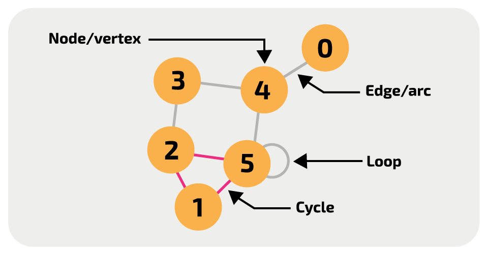

# Graph

In computer science, a **graph** is an abstract data type that is meant to implement the undirected graph and directed graph concepts from mathematics, specifically the field of graph theory

- **Undirected Graph**: a graph in which the adjacency relation is symmetric. So if there exists an edge from node U to node V (U -> V), then it is also the case that there exists an edge from node V to node U (V -> U)
- **Directed Graph**: a graph in which the adjacency relation is not symmetric. So if there exists an edge from node U to node V (U -> V), this does *not* imply that there exists an edge from node V to node U (V -> U)

